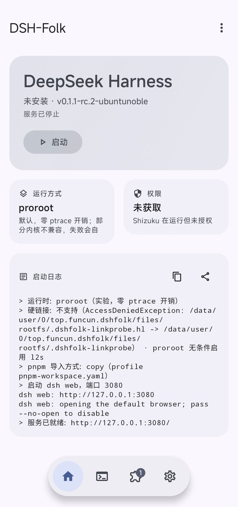
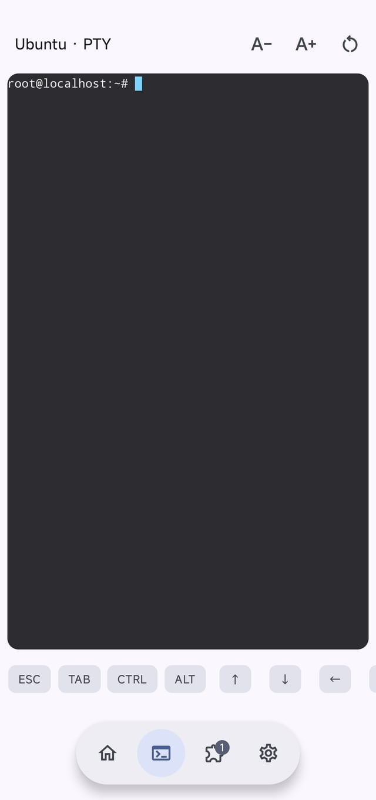
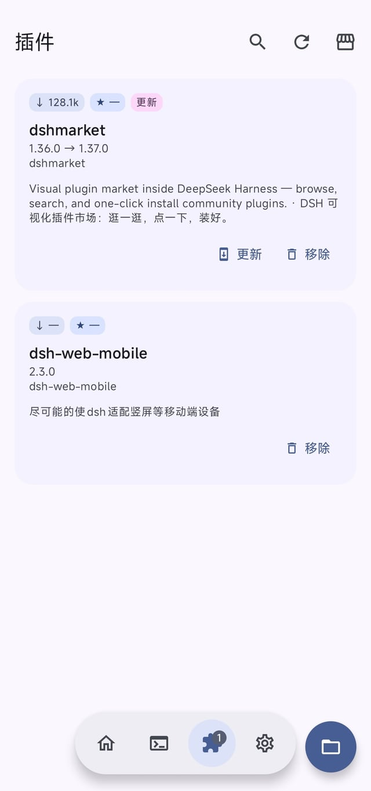
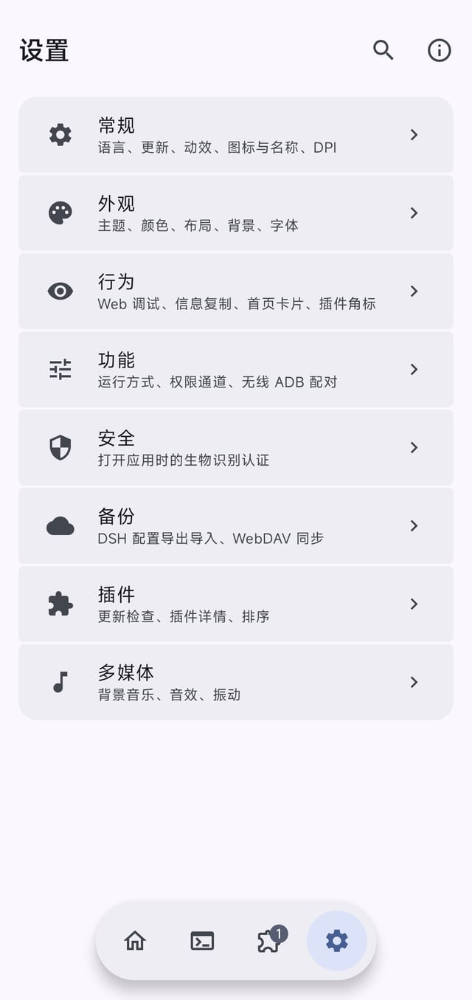

<div align="center">

# DSH-Folk

**在 Android 上跑 DeepSeek Harness 的启动器**

[](./LICENSE)
[](https://github.com/IPF-Sinon/DSH-Folk/actions/workflows/build.yml)
[](https://github.com/IPF-Sinon/DSH-Folk/releases/latest)

</div>

DSH-Folk 把 [DeepSeek Harness](https://www.npmjs.com/package/@deepseek-ai/dsh)（一个 Node.js 的编码 Agent CLI）装进手机：
应用下载一份 arm64 Linux 容器运行时，用 proot / proroot 在容器里启动 `dsh web`，然后你在手机上直接打开它的 Web UI。

不需要 root，也不需要 Termux。有 root / Shizuku / 无线 ADB 时会自动利用，用于放宽某些受限操作。

## 预览

<div align="center">

| 主页 | 终端 |
| :---: | :---: |
|  |  |
| **插件** | **设置** |
|  |  |

</div>

## 现在能做什么

| 页面 | 说明 |
| --- | --- |
| **主页** | 一键启动 / 停止 / 重启 DSH，显示运行阶段、Web UI 地址、当前运行方式与权限通道，带可复制的启动日志 |
| **终端** | 容器内的真 PTY 终端（基于 Termux 的 `terminal-view`），直接 `bash` 进容器 |
| **插件** | 管理容器里 DSH 的插件，展示 npm 周下载量、GitHub star 与 dsh-market 点赞；内置插件商店（下载完整目录后本地搜索，2600+ 条），支持本地 .tgz 安装。装完会用临时端口验证一次插件树能否加载，不通过自动卸载 |
| **设置** | 常规 / 外观 / 行为 / 功能 / 安全 / 备份 / 插件 / 多媒体，界面主题体系沿用 FolkPatch（`theme.json` 完全兼容） |

**配置备份**与 DSH 桌面端的 `dsh-config-manager` 插件使用**同一套导出格式**（走它的回环 HTTP API，不是另写一份 ZIP 打包器），
所以手机上导出的 zip 能直接在电脑上导入，反之亦然。默认导出 settings / ui / providers / plugins / mcp / prompts /
skills / agentPresets / agentInstructions / workspaces / pluginFiles / credentialsStatus / self，
不导 sessions（会话记录体积能到几百 MB）；凭据值不导出，可选整包 AES-256-GCM 加密。

## 环境要求

- Android 8.0 (API 26) 或更高
- **arm64-v8a** 设备（不支持 32 位）
- 首次启动需要联网下载运行时（约 150 MB 压缩包，解压后约 600 MB；可在设置里选镜像或自动测速）
- 存储空间建议预留 2 GB 以上

首次启动下载完运行时后会自动预装三个插件：`dsh-web-mobile`（移动端适配）、`dshmarket`（WebUI 内的插件市场）、
`dsh-config-manager`（**配置备份功能的依赖**，设置里的导出/导入走它的回环 API）。
这一步会多花一两分钟；失败不影响启动，之后可以在插件商店里手动装。
预装清单按包名逐个记账，所以从旧版本升级上来会自动补装新增的那几个。

应用自身的更新可以在 设置 → 常规 → 检查更新 里完成：它会对三条下载渠道（GitHub 直连 / 两个 gh-proxy）
测延迟与吞吐，下载支持断点续传，装之前必须通过 release 附带的 `.sha256` 校验 —— 校验不过一律不装。

root / Shizuku / 无线 ADB 都是**可选**的。DSH-Folk 只探测并复用设备上已有的 su（Magisk / KernelSU / APatch）与已授权的 Shizuku / Sui，
自身不打任何内核补丁、不安装 su、不内置 Shizuku Server。

配对成功后容器里多出一个 `adb-shell` 命令（以 shell / uid 2000 身份在设备上执行）。默认只放行只读命令
（`getprop` / `dumpsys` / `ls` / `cat` 之类）；写操作和 `--su` 提权要在 **设置 → 功能** 里分别打开开关，
没打开时命令会被拒绝并提示开关位置。

## 安装

到 [Releases](https://github.com/IPF-Sinon/DSH-Folk/releases/latest) 下载 `DSH-Folk-<版本>.apk`，
同目录的 `.sha256` 可用于校验。

也可以到 [Actions](https://github.com/IPF-Sinon/DSH-Folk/actions/workflows/build.yml) 取开发构建：
选一次成功的运行，下载 `dsh-folk-debug-*` 或 `dsh-folk-release-*` 工件。

APK 只由 GitHub Actions 构建，不提供本地打包的产物。想自己出包：在 Actions 里手动触发 **Build DSH-Folk**
（`workflow_dispatch`，可选 debug / release / both）。release 需要在仓库 secrets 里配置
`KEYSTORE_BASE64` / `KEYSTORE_PASSWORD` / `KEY_ALIAS` / `KEY_PRIVATE_PASSWORD`；
缺任何一项会**直接构建失败**而不是退回调试签名 —— 一个用 debug key 签出来的「release」装得上、看着正常，
但和正式包签名不同、之后无法覆盖升级，比构建失败危险得多。构建末尾还有一道签名自检拦住这种情况。

容器运行时由另一个工作流 **Build DSH runtime rootfs** 生成，产物（`rootfs.tar.gz` + `metadata.json`）
发布到滚动 tag `runtime-latest`，应用启动时读取其中的 `metadata.json` 决定下载什么。

## 它是怎么跑起来的

```
DSH-Folk (Android app)
  └─ proot / proroot                      ← 打包在 APK 里的可执行 .so
       └─ Ubuntu 24.04 arm64 rootfs       ← 首次启动时在线下载
            ├─ python3                     ← 无线 ADB 配对用，已预装
            ├─ git                          ← git 源插件用，已预装
            └─ Node.js 24 + @deepseek-ai/dsh
                 └─ dsh web --port 3080    ← 只监听 127.0.0.1
                      └─ 手机浏览器 / 应用内打开
```

几个不得不这么做的地方：

- Android 的 `app_data_file` 带 **noexec**，只有 `nativeLibraryDir` 里的 `.so` 可执行，所以 proot / proroot 以 `.so` 形式打包进 APK。
- 部分设备的私有目录禁止 `link(2)`（真机实测报 `AccessDeniedException`），应用会先探测硬链接是否可用，不可用时给 proot 加 `--link2symlink`；
  proroot 则无条件启用它。而 pnpm 正是用 `link()` 从内容存储装包 —— 链接一旦被改写成符号链接，
  Node 的 `require.resolve` 做 realpath 就会解析进内容存储的扁平哈希目录，插件声明的 `./lib/client.cjs` 再也拼不出来
  （表现是装完插件 `dsh web` 报 `MissingClientBundleError`）。所以这种环境下会给 profile 的 `pnpm-workspace.yaml`
  写上 `packageImportMethod: copy`，让 pnpm 复制真实文件。代价是内容存储的去重失效，容器体积会大一些。
- 插件目录里超过一半的条目是 `github:owner/name` 安装规格，pnpm 解析它要 `git ls-remote`，所以 git 也预装进了 rootfs。
  注意 rootfs 是用 `dpkg-deb -x` 纯解包装出来的（runner 是 x86_64，跑不了 arm64 的 maintainer script），
  **dpkg 的依赖关系没人替我们解** —— 包列表写漏一个传递依赖，构建期一切正常，到手机上 exec 那一刻才报
  `cannot find libxxx.so.N`。所以构建末尾有一步 `check-elf-closure.js`：从 git-core / perl 扩展 / python3
  出发递归解析 ELF 的 `DT_NEEDED`，任何 SONAME 找不到提供者就让构建失败。
- `dsh web` 只绑定回环地址；配置备份走的也是同一个回环 HTTP 接口，不对局域网开放。

## 项目结构

```
app/src/main/java/me/bmax/apatch/
  dsh/                  运行时层：下载安装、proot 启动、权限探测、无线 ADB、PTY、配置备份
  ui/screen/HomeDsh.kt  主页
  ui/screen/Dsh*.kt     终端 / 插件 / 插件商店
  ui/screen/settings/   设置各分页
runtime-builder/        容器 rootfs 构建脚本（在 CI 上跑）+ 动态库闭包检查
.github/workflows/      build.yml（APK） + runtime.yml（rootfs）
```

内部包名保留 `me.bmax.apatch`（applicationId 是 `top.funcun.dshfolk`）：
这样 FolkPatch 的整套主题子系统与用户已有的 `theme.json` 不需要改一行就能继续用。

## 致谢

DSH-Folk 的 UI 直接复用 FolkPatch，容器与运行时交付思路来自 DSHA / DSHM：

- [FolkPatch](https://github.com/LyraVoid/FolkPatch) —— 本项目的 UI 基础（GPL-3.0）
- [APatch](https://github.com/bmax121/APatch) —— FolkPatch 的上游
- [DSHA](https://github.com/IPF-Sinon) —— 无线 ADB 配对方案、容器运行逻辑参考
- [DSHM](https://github.com/IPF-Sinon) —— 运行时在线交付与镜像测速方案
- [DeepSeek Harness](https://www.npmjs.com/package/@deepseek-ai/dsh) —— 被启动的本体
- [proot](https://github.com/proot-me/proot) / [proroot](https://github.com/coderredlab/proroot) / [Termux](https://github.com/termux/termux-app) —— 容器执行与 PTY 终端
- [Shizuku](https://github.com/RikkaApps/Shizuku) —— 免 root 特权通道
- [KernelSU](https://github.com/tiann/KernelSU) / [SukiSU-Ultra](https://github.com/SukiSU-Ultra/SukiSU-Ultra) —— 界面设计参考

## 许可证

[GNU General Public License v3.0](./LICENSE)。本项目派生自 GPL-3.0 的 FolkPatch，因此整体沿用 GPL-3.0：
分发（含二次修改）必须同样以 GPLv3 开源并提供完整源码。

## 友情链接

LINUX DO 开源社区 | [linux.do](https://linux.do) 

## 交流

- QQ 群：[1109060326](https://qm.qq.com/q/t7HDoR5ACk)
- Issues：https://github.com/IPF-Sinon/DSH-Folk/issues
